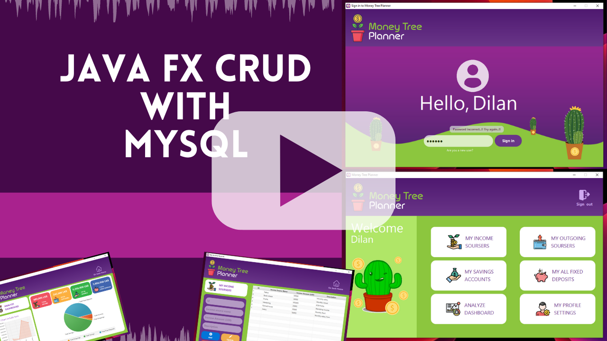

# 2.2 RAD Project JavaFX | Money Tree Planner

The importance of personal financial planning is cannot be ignored. It is not just about increasing your savings and reducing your expenses. Financial planning is a lot more than that. This includes achieving your future goals. Here we have provided secure login to our application. The user will be able to add his income sources, outgoing sources, fixed deposit details, and analytics to the dashboard to get an overall idea. This is a single-user application that provides a quick idea of a wealth plan.

Users can add savings account details separately for each bank. It will be easier to get the final balance of bank accounts. Also, users can add customized income, outgoing sources as per need. Additionally, we have provided a user profile settings tab to manage user account details.
Users can alter the settings according to their own needs with the highly flexible and customizable functions available.

✔️ Super easy and simple to enter data anytime, anywhere. 
✔️ View your spending tendencies graphically. 
✔️ View statistics by simply entering the data. 
✔️ Calculated final balance. 
✔️ Set up cash flows as necessary. 
✔️ Manage all your accounts at once. 
✔️ Check financial statistics. 
✔️ Use budget planning features to plan your budget. 

## Used Technologies
✔️ Java 
✔️ Java FX 
✔️ CSS 
✔️ MySQL 

## Have trouble with project setup? Watch video below.

